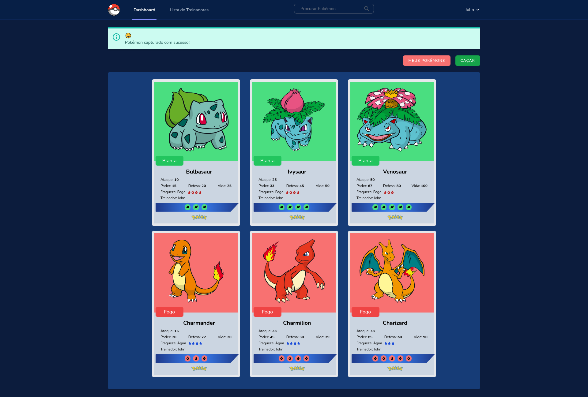

# beacademy-devstart-pokecademy

## Projeto Individual

-   [x] Criar um CRUD em PHP, utilizando Laravel;
-   [x] O sistema deverá possuir autenticação;
-   [x] Utilizar o banco de dados Mysql para criar uma tabela - de sua preferência, com 10 atributos;
-   [x] O CRUD deve conter os métodos de Insert, Update, Delete e Read dessa tabela;
-   [x] As ações deverão ser realizadas através de uma página web, portanto o sistema deverá conter um frontend que se comunique com o backend;
-   [x] A solução deve ter pelo menos 30% de testes unitários;
-   [x] O projeto deverá ser armazenado no repositório do github;

### Tema do projeto: Cartas de pokémons

### Descrição

-   O usuário pode criar cartas de pokémons.
-   Apenas o usuário que criou a carta poderá alterá-la ou deletá-la.
-   Projeto contém uma página para visualizar os treinadores (usuários) e uma página para visualizar os pokémons.
-   Apenas o Administrador tem acesso a página de treinadores, local onde é possível editar e deletar treinadores.
-   O usuário pode alterar seus dados pelo menu de perfil.
-   O projeto contém 38.0% de testes realizados sem contar os de autenticação e 66.8% incluindo os de autenticação.

**Versão Live**
<a target="_blank" href="https://pokecademy.herokuapp.com/">https://pokecademy.herokuapp.com/</a>

  
Administrador

    

        <strong>Login:</strong>
        <code>john.doe@email.com</code>
     
        <strong>Senha:</strong>
        <code>12345678</code>
    

  

